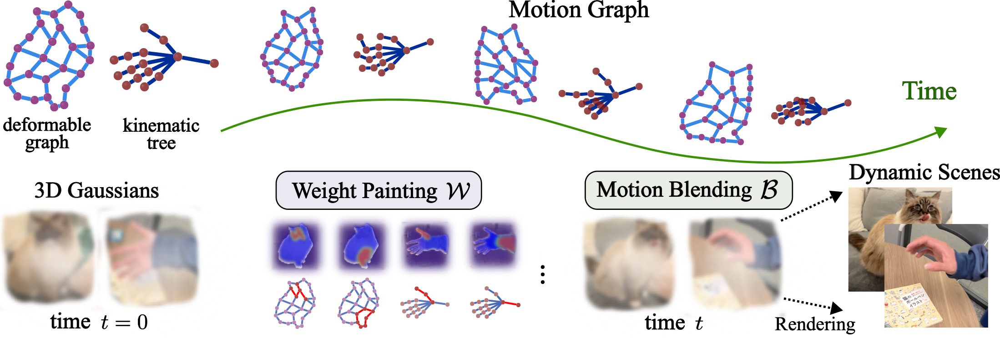

# Motion Blender Gaussian Splatting

[](https://arxiv.org/abs/2503.09040) [](https://mlzxy.github.io/motion-blender-gs)




Our method reconstructs motions into **explicit** and **sparse** motion graphs, so the reconstructed dynamic scenes can be further manipulated.

- Please check [Env.md](Env.md) for installation, [Data.md](Data.md) to download datasets and weights. 
- We also provide a very basic Gaussian editor based on [VISER](https://viser.studio/main/), a 2D point tracker tool (based on cotracker), a nice SAM2 video annotator, a Grounding SAM2 notebook, and a SAPIENS human keypoint extraction script. They are summarized in [Tools.md](Tools.md). 

Here is a [youtube video](https://youtu.be/hsLUvXhTAuo) where I explain the codebase and tools a bit.


---

Once data and environment are configured, run the following scripts to fit scenes. 


```bash
# iphone: apple, backpack, block, creeper, handwavy, haru-sit, mochi-high-five, paper-windmill, pillow, spin, sriracha-tree, teddy
bash ./scripts/fit/iphone.sh scene-name

# hypernerf: broom2, vrig-3dprinter, vrig-chicken, vrig-peel-banana
bash ./scripts/fit/hypernerf.sh scene-name

# robot scenes: robot, cloth, microwave, rope
bash ./scripts/fit/robot.sh scene-name
```

- The key implementation is in two files: [animate.py](motionblender/lib/animate.py) and [motion.py](motionblender/lib/motion.py). [animate_lib.ipynb](scripts/notebooks/animate_lib.ipynb) shows some simple examples of graph fitting. 
- [render_gs_and_graph.ipynb](scripts/notebooks/render_gs_and_graph.ipynb) and [render_cloth.ipynb](scripts/notebooks/render_cloth.ipynb) provide examples on gaussians and motion graphs rendering

---

If this work is helpful to you, please cite the below. This work is inspired by and heavily built on [shape-of-motion](https://github.com/vye16/shape-of-motion), please consider citing them as well.

```bibtex
@article{zhang2025motion,
    title={Motion Blender Gaussian Splatting for Dynamic Scene Reconstruction},
    author={Zhang, Xinyu and Chang, Haonan and Liu, Yuhan and Boularias, Abdeslam},
    journal={arXiv preprint arXiv:2503.09040},
    year={2025}
}
```
