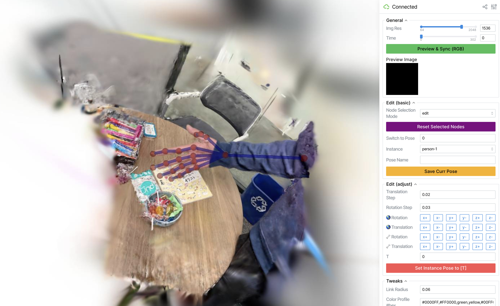

Please do check my [video](https://youtu.be/hsLUvXhTAuo) on explaining the tools. 

The following script assumes the datasets and weights are setted up. 


# SAM2 Video Annotator


```bash
export PYTHONPATH=$PYTHONPATH:Grounded-SAM-2/ 
port=8891 ckpt_dir=Grounded-SAM-2/checkpoints bash ./motionblender/preproc/sam2gui/run_gui_app.sh ./datasets/robot/microwave/sam2_task_center.json
```


# 2D Point Track Annotator


> Used in the robot/rope, as the 2D guidance for the kinematic tree.


```bash
python3 ./motionblender/preproc/cotracker_app.py  --task_jsons ./datasets/robot/rope/track_task_center.json  --frame_limit 600
```

Note that this app will automatically create a serial chain connectivity definition at `datasets/robot/rope/keypoints/1/keypoints_connectivity.json` (if not present, `1` stands for instance id), you may need to modify it because a symmetrical kinematic tree is preferred. The rope connectivity file is a good example (rooted at the rope middle).

This tool is modified from the [cotracker app](https://huggingface.co/spaces/facebook/cotracker/tree/main) in huggingface.


# Gaussian Editor



To visualize and edit a scene: 

```bash
bash ./scripts/run_gui_app.sh  outputs/weights/iphone/handwavy/ckpt.cpkl
```


# Grounding SAM2 Notebooks

There are a notebook [ov-detect-track.general.ipynb](motionblender/preproc/sam2gui/ov-detect-track.general.ipynb). You configure the text prompt, where to find images, some detection & tracking thresholds (like below), then run all the other cells.


```python
BOX_THRESHOLD = 0.35
TEXT_THRESHOLD = 0.25
REDETECT_INTERVAL = 1000
REVERSE_TRACK = False
CAM_TAG = 'left1' # choose from ["left1", "right1"] (for hypernerf)

TEXT_PROMPT = "person.banana."
SCENE = "vrig-peel-banana"


PROMPT_TYPE_FOR_VIDEO = "box" # choose from ["point", "box", "mask"]
DEVICE = "cuda" if torch.cuda.is_available() else "cpu"

VIDEO_PATH = osp.join(f"./datasets/hypernerf/{SCENE}", f'rgb/2x/{CAM_TAG}_*.png') 
OUTPUT_PATH = osp.join(f"./datasets/hypernerf/{SCENE}", 'instance/2x')
```


> There is another notebook [ov-detect-track.iphone.ipynb](motionblender/preproc/sam2gui/ov-detect-track.iphone.ipynb) in the same folder, but was developed early just for the iphone dataset.


# SAPIENS Keypoint Extraction Script

> this assumes sapiens 

```bash
bash ./motionblender/preproc/sapiens_extract.sh  datasets/iphone/apple/rgb/1x datasets/iphone/apple/flow3d_preprocessed/sapiens 0 # input output gpu-id
```


# Colmap Runner

The colmap output is not used in this work, but you're welcome to try this script. This script run colmap on multiple images with camera poses and produce a point cloud (or one point cloud for each instance).

> Make sure the command `colmap` is installed. Recommend to compile [colmap](https://github.com/colmap/colmap) with CUDA support, instead of a standard installation. 

```bash
export DATA_ROOT=datasets/hypernerf 
python3 ./motionblender/preproc/colmap.py prepare vrig-peel-banana --factor 2
python3 ./motionblender/preproc/colmap.py run vrig-peel-banana
python3 ./motionblender/preproc/colmap.py extract_pcd_each_instance vrig-peel-banana
python3 ./motionblender/preproc/colmap.py clean_dense_dir vrig-peel-banana
```


# Pointcloud and Graph Visualizer (based on PyVista)


Pvstate files will be saved during training from the `save_pv_vis` function in [train.py](motionblender/train.py), 
they are pickled data for the `motionblender.lib.pv.Plotter` to visualize motion graphs and gaussians as point clouds. 

A notebook that visualizes pvstate files is [tv.ipynb](scripts/notebooks/vis/tv.ipynb). 


# Depth Extracting from Depth-Anything 

> Adopted from shape-of-motion, only used in iphone dataset.

```bash
python3 motionblender/preproc/depth.py --dataset-path datasets/robot/cloth
```

Note the estimated depth (at least from depth-anything) is neither accurate nor consistent across multiple viewpoints or time steps. This is why some iphone reconstructions looks kind of weird in 3D, like the `apple` in scene apple. 


# TAPIR Point Tracking (any frame to any frame)

> Adopted from shape-of-motion, used in iphone, and partially used in hypernerf. Not used in robot experiment.


```bash
python3 ./motionblender/preproc/tracks_torch.py --image_dir datasets/hypernerf/broom2/rgb/2x  --mask_dir  datasets/hypernerf/broom2/instance/2x/imask \
     --out_dir datasets/hypernerf/broom2/bootstapir/2x --image_prefix left1 --dataset-json datasets/hypernerf/broom2/dataset.json \
     --ckpt_dir outputs/weights/other --grid_size 2
     
# if mask_dir, dataset-json are not provided, then the point tracks will run on the entire image.
```

2d tracks are helpful (not always) but expensive, sharing more comments in the video.

